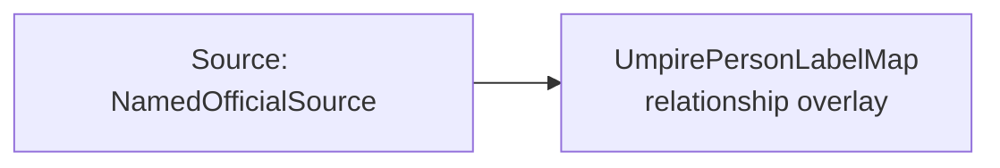

<!-- Generated by scripts/generate_rml_mermaid.py; do not edit. -->
<!-- Mapping SHA-256: 11be74814589051873cc48ee2c8577d3b1303ac7473b6114aa6740b30df96d0f -->

# Available game-official names - MLB game RML

An official's stable identity is independent of whether this response supplies a name; a label is emitted only when MLB provides the name.

Solid relation arrows are explicit parent-triples-map joins. Dotted arrows match IRI templates or IRI-valued references within the same logical source. Cross-pattern targets are listed in the table rather than drawn. Unresolved dynamic resource types remain generic; the accepted design supplies their reviewed interpretation.

## Logical sources

| Source | Execution file | JSONPath iterator | Maps in this review |
| --- | --- | --- | ---: |
| `NamedOfficialSource` | `game-context.json` | `$.liveData.boxscore.officials[?(@._baseballO.hasOfficialName == true)]` | 1 |

## Triples maps

| Triples map | Subject class | Emitted relations | Cross-pattern targets |
| --- | --- | --- | --- |
| `UmpirePersonLabelMap` | relationship overlay | label | none |
