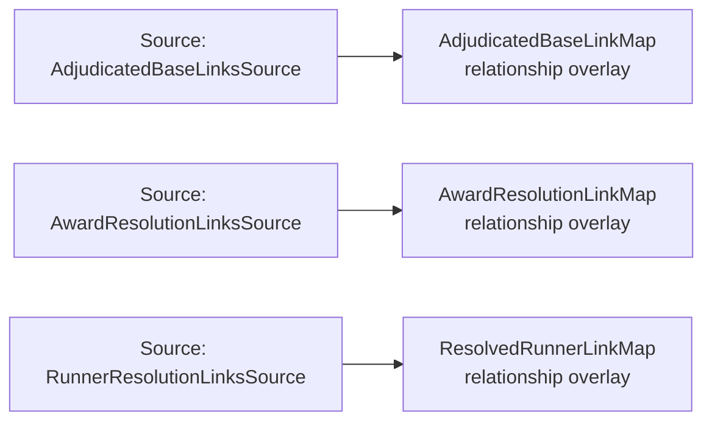

<!-- Generated by scripts/generate_rml_mermaid.py; do not edit. -->
<!-- Mapping SHA-256: 76b433db32acb7e8d69d7aeaabd0b6faa4e1973919c14b99d49047880065e471 -->

# Runner resolution and award links - MLB game RML

A resolution identifies its runner; a supported Safe Process identifies its adjudicated Base; a completed direct or forced walk/HBP arrival settles its particular award without asserting continued entitlement or batter causation.

Solid relation arrows are explicit parent-triples-map joins. Dotted relation arrows are IRI-template matches inferred by the reviewer from the actual RML templates. Cross-pattern targets are listed in the table rather than drawn, keeping the diagram small.

## Logical sources

| Source | Execution file | JSONPath iterator | Maps in this review |
| --- | --- | --- | ---: |
| `AdjudicatedBaseLinksSource` | `game-context.json` | `$.liveData.plays.allPlays[*]._baseballO.adjudicatedBaseLinks[*]` | 1 |
| `AwardResolutionLinksSource` | `game-context.json` | `$.liveData.plays.allPlays[*]._baseballO.awardResolutionLinks[*]` | 1 |
| `RunnerResolutionLinksSource` | `game-context.json` | `$.liveData.plays.allPlays[*]._baseballO.runnerResolutionLinks[*]` | 1 |

## Triples maps

| Triples map | Subject class | Emitted relations | Cross-pattern targets |
| --- | --- | --- | --- |
| `ResolvedRunnerLinkMap` | relationship overlay | has resolved runner | has resolved runner -> PlateAppearanceStartRunnerLocationMap (template) |
| `AdjudicatedBaseLinkMap` | relationship overlay | has adjudicated base | has adjudicated base -> BaserunningOriginBaseMap (template) |
| `AwardResolutionLinkMap` | relationship overlay | settles award from | settles award from -> Result (template) |
