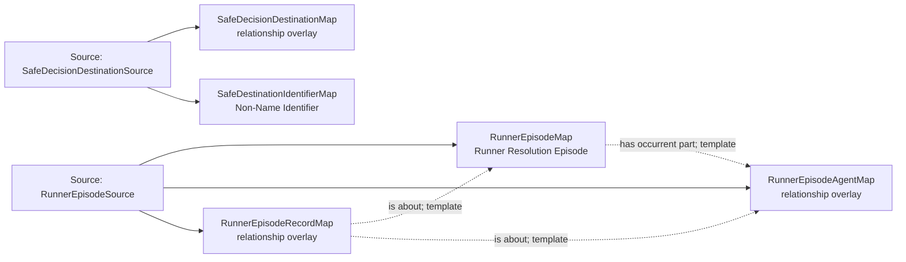

<!-- Generated by scripts/generate_rml_mermaid.py; do not edit. -->
<!-- Mapping SHA-256: b89377d634df094aef78de708e811ac44b66284dbbc0ba86bb21cde578077127 -->

# Runner episode and safe decision destination - MLB game RML

An episode pairs one baserunning act and resolution. The act has the runner as agent; the Safe Decision identifies the counted destination.

Solid relation arrows are explicit parent-triples-map joins. Dotted arrows match IRI templates or IRI-valued references within the same logical source. Cross-pattern targets are listed in the table rather than drawn. Unresolved dynamic resource types remain generic; the accepted design supplies their reviewed interpretation.

## Logical sources

| Source | Execution file | JSONPath iterator | Maps in this review |
| --- | --- | --- | ---: |
| `RunnerEpisodeSource` | `game-context.json` | `$.liveData.plays.allPlays[*]._baseballO.runnerEpisodes[*]` | 3 |
| `SafeDecisionDestinationSource` | `game-context.json` | `$.liveData.plays.allPlays[*]._baseballO.safeDecisionDestinations[*]` | 2 |

## Triples maps

| Triples map | Subject class | Emitted relations | Cross-pattern targets |
| --- | --- | --- | --- |
| `RunnerEpisodeMap` | Runner Resolution Episode | has occurrent part, occurrent part of | has occurrent part -> Runner Resolution (template), occurrent part of -> PlateAppearanceCoreContainmentMap (template) |
| `RunnerEpisodeAgentMap` | relationship overlay | has agent | has agent -> PlateAppearanceStartRunnerLocationMap (template) |
| `RunnerEpisodeRecordMap` | relationship overlay | is about | none |
| `SafeDecisionDestinationMap` | relationship overlay | is about | is about -> PlateAppearanceStartBaseArtifactMap (template) |
| `SafeDestinationIdentifierMap` | Non-Name Identifier | designates, has text value | designates -> PlateAppearanceStartBaseArtifactMap (template) |
