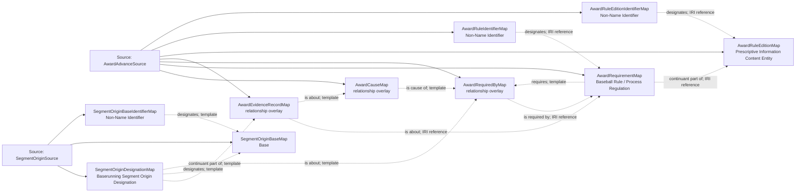

<!-- Generated by scripts/generate_rml_mermaid.py; do not edit. -->
<!-- Mapping SHA-256: 9dda8b5110491293e9b7c93625275eca382790b5a0be0147b2781cea4a2d4a47 -->

# Required award advances and source-designated segment origins - MLB game RML

A walk/HBP causes only an evidenced exact award advance required by its applicable rule. A source origin designation identifies movement.start without asserting a stasis or continuity.

Solid relation arrows are explicit parent-triples-map joins. Dotted arrows match IRI templates or IRI-valued references within the same logical source. Cross-pattern targets are listed in the table rather than drawn. Unresolved dynamic resource types remain generic; the accepted design supplies their reviewed interpretation.

## Logical sources

| Source | Execution file | JSONPath iterator | Maps in this review |
| --- | --- | --- | ---: |
| `AwardAdvanceSource` | `game-context.json` | `$.liveData.plays.allPlays[*]._baseballO.awardAdvances[*]` | 7 |
| `SegmentOriginSource` | `game-context.json` | `$.liveData.plays.allPlays[*]._baseballO.segmentOrigins[*]` | 3 |

## Triples maps

| Triples map | Subject class | Emitted relations | Cross-pattern targets |
| --- | --- | --- | --- |
| `SegmentOriginDesignationMap` | Baserunning Segment Origin Designation | continuant part of, designates, is about | none |
| `SegmentOriginBaseMap` | Base | type assertion only | none |
| `SegmentOriginBaseIdentifierMap` | Non-Name Identifier | designates, has text value | none |
| `AwardCauseMap` | relationship overlay | is cause of | none |
| `AwardRequirementMap` | Baseball Rule, Process Regulation | continuant part of, requires | none |
| `AwardRequiredByMap` | relationship overlay | is required by | none |
| `AwardEvidenceRecordMap` | relationship overlay | is about | none |
| `AwardRuleEditionMap` | Prescriptive Information Content Entity | type assertion only | none |
| `AwardRuleIdentifierMap` | Non-Name Identifier | designates, has text value | none |
| `AwardRuleEditionIdentifierMap` | Non-Name Identifier | designates, has text value | none |
