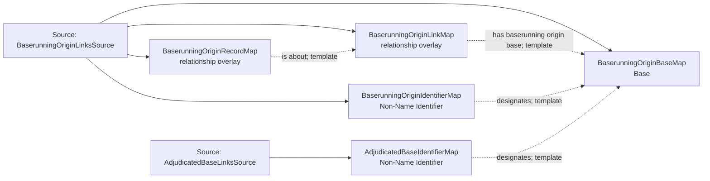

<!-- Generated by scripts/generate_rml_mermaid.py; do not edit. -->
<!-- Mapping SHA-256: 76b433db32acb7e8d69d7aeaabd0b6faa4e1973919c14b99d49047880065e471 -->

# Baserunning origin and explicit Base identifiers - MLB game RML

The particular baserunning act identifies its corroborated origin Base and source record. Origin and adjudicated destination Bases have explicit categorical Code Identifiers; neither absence nor an IRI string supplies metric state.

Solid relation arrows are explicit parent-triples-map joins. Dotted relation arrows are IRI-template matches inferred by the reviewer from the actual RML templates. Cross-pattern targets are listed in the table rather than drawn, keeping the diagram small.

## Logical sources

| Source | Execution file | JSONPath iterator | Maps in this review |
| --- | --- | --- | ---: |
| `AdjudicatedBaseLinksSource` | `game-context.json` | `$.liveData.plays.allPlays[*]._baseballO.adjudicatedBaseLinks[*]` | 1 |
| `BaserunningOriginLinksSource` | `game-context.json` | `$.liveData.plays.allPlays[*]._baseballO.baserunningOriginLinks[*]` | 4 |

## Triples maps

| Triples map | Subject class | Emitted relations | Cross-pattern targets |
| --- | --- | --- | --- |
| `BaserunningOriginLinkMap` | relationship overlay | has baserunning origin base | none |
| `BaserunningOriginBaseMap` | Base | type assertion only | none |
| `BaserunningOriginIdentifierMap` | Non-Name Identifier | designates, has text value | none |
| `BaserunningOriginRecordMap` | relationship overlay | is about | none |
| `AdjudicatedBaseIdentifierMap` | Non-Name Identifier | designates, has text value | none |
