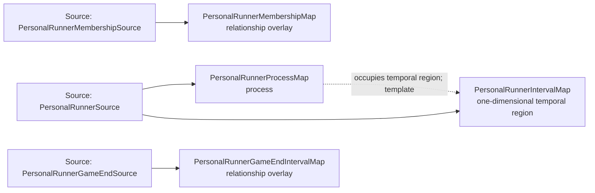

<!-- Generated by scripts/generate_rml_mermaid.py; do not edit. -->
<!-- Mapping SHA-256: bed3f052e82a896b8529c67b8e2a5c9746b06eef0788276d70bec48335fb63a4 -->

# Source-reconciled personal runner lifetime - MLB game RML

The accepted C1 BFO Process contains the complete supported episode membership for one runner in one half inning, occupies its own interval and inherits no agency or role realization. Still-active histories in a reconciled walk-off end at the existing game endpoint without a fabricated out or advance.

Solid relation arrows are explicit parent-triples-map joins. Dotted arrows match IRI templates or IRI-valued references within the same logical source. Cross-pattern targets are listed in the table rather than drawn. Unresolved dynamic resource types remain generic; the accepted design supplies their reviewed interpretation.

## Logical sources

| Source | Execution file | JSONPath iterator | Maps in this review |
| --- | --- | --- | ---: |
| `PersonalRunnerGameEndSource` | `game-context.json` | `$._baseballO.runnerHistoryReconciliation.histories[?(@.terminal == 'game-ended')]` | 1 |
| `PersonalRunnerMembershipSource` | `game-context.json` | `$._baseballO.runnerHistoryReconciliation.episodeMembership[*]` | 1 |
| `PersonalRunnerSource` | `game-context.json` | `$._baseballO.runnerHistoryReconciliation.histories[*]` | 2 |

## Triples maps

| Triples map | Subject class | Emitted relations | Cross-pattern targets |
| --- | --- | --- | --- |
| `PersonalRunnerProcessMap` | process | has participant, occupies temporal region, occurrent part of | has participant -> PlateAppearanceStartRunnerLocationMap (template), occurrent part of -> Inning (template) |
| `PersonalRunnerIntervalMap` | one-dimensional temporal region | type assertion only | none |
| `PersonalRunnerMembershipMap` | relationship overlay | has occurrent part | has occurrent part -> RunnerEpisodeMap (template) |
| `PersonalRunnerGameEndIntervalMap` | relationship overlay | has last instant | has last instant -> Referenced resource (IRI reference) |
