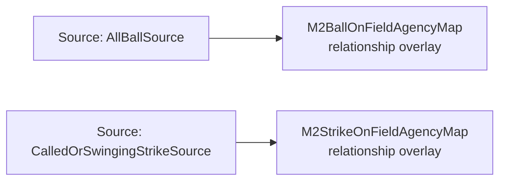

<!-- Generated by scripts/generate_rml_mermaid.py; do not edit. -->
<!-- Mapping SHA-256: bed3f052e82a896b8529c67b8e2a5c9746b06eef0788276d70bec48335fb63a4 -->

# Original pitch umpire attribution - MLB game RML

An affirmed reviewed pitch retains the on-field umpire on the original judgment; the operative review judgment does not inherit that role.

Solid relation arrows are explicit parent-triples-map joins. Dotted arrows match IRI templates or IRI-valued references within the same logical source. Cross-pattern targets are listed in the table rather than drawn. Unresolved dynamic resource types remain generic; the accepted design supplies their reviewed interpretation.

## Logical sources

| Source | Execution file | JSONPath iterator | Maps in this review |
| --- | --- | --- | ---: |
| `AllBallSource` | `game-context.json` | `$.liveData.plays.allPlays[*].playEvents[?(@.isPitch == true && @.details.call.code == 'B' \|\| @.isPitch == true && @.details.call.code == '*B')]` | 1 |
| `CalledOrSwingingStrikeSource` | `game-context.json` | `$.liveData.plays.allPlays[*].playEvents[?(@.isPitch == true && @.details.call.code == 'C' \|\| @.isPitch == true && @.details.call.code == 'S' \|\| @.isPitch == true && @.details.call.code == 'W' \|\| @.isPitch == true && @.details.call.code == 'M')]` | 1 |

## Triples maps

| Triples map | Subject class | Emitted relations | Cross-pattern targets |
| --- | --- | --- | --- |
| `M2BallOnFieldAgencyMap` | relationship overlay | has participant, realizes | has participant -> Person (template), realizes -> Umpire (template) |
| `M2StrikeOnFieldAgencyMap` | relationship overlay | has participant, realizes | has participant -> Person (template), realizes -> Umpire (template) |
