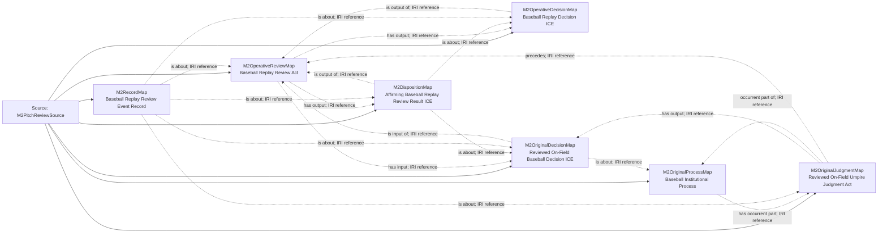

<!-- Generated by scripts/generate_rml_mermaid.py; do not edit. -->
<!-- Mapping SHA-256: bed3f052e82a896b8529c67b8e2a5c9746b06eef0788276d70bec48335fb63a4 -->

# Affirmed review of a particular called pitch - MLB game RML

The operative pitch judgment is the review act. Distinct original and operative decisions concern the same pitched motion; one counted result and reconciled review identity are retained.

Solid relation arrows are explicit parent-triples-map joins. Dotted arrows match IRI templates or IRI-valued references within the same logical source. Cross-pattern targets are listed in the table rather than drawn. Unresolved dynamic resource types remain generic; the accepted design supplies their reviewed interpretation.

## Logical sources

| Source | Execution file | JSONPath iterator | Maps in this review |
| --- | --- | --- | ---: |
| `M2PitchReviewSource` | `game-context.json` | `$._baseballO.metricPitchReviews[*]` | 7 |

## Triples maps

| Triples map | Subject class | Emitted relations | Cross-pattern targets |
| --- | --- | --- | --- |
| `M2OperativeReviewMap` | Baseball Replay Review Act | has input, has output, occurrent part of, type | occurrent part of -> Referenced resource (IRI reference), type -> Referenced resource (IRI reference) |
| `M2OperativeDecisionMap` | Baseball Replay Decision ICE | is about, is output of | is about -> Referenced resource (IRI reference) |
| `M2OriginalJudgmentMap` | Reviewed On-Field Umpire Judgment Act | has agent, has input, has output, occurrent part of, precedes, type | has agent -> Person (template), has input -> Referenced resource (IRI reference), type -> Referenced resource (IRI reference) |
| `M2OriginalDecisionMap` | Reviewed On-Field Baseball Decision ICE | is about, is input of, type | is about -> Referenced resource (IRI reference), type -> Referenced resource (IRI reference) |
| `M2OriginalProcessMap` | Baseball Institutional Process | has occurrent part | none |
| `M2DispositionMap` | Affirming Baseball Replay Review Result ICE | is about, is output of | none |
| `M2RecordMap` | Baseball Replay Review Event Record | is about | is about -> Referenced resource (IRI reference) |
