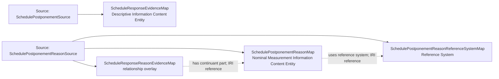

<!-- Generated by scripts/generate_rml_mermaid.py; do not edit. -->
<!-- Mapping SHA-256: a67dbfc25c191c8b89cbb9a38b4e3a3f348374e37180679a6c7c99f69e4088a9 -->

# Postponement source and reason evidence - MLB game RML

Existing schedule-response evidence and nominal reason classification, separated from the schedule revision view to keep both diagrams readable.

Solid relation arrows are explicit parent-triples-map joins. Dotted arrows match IRI templates or IRI-valued references within the same logical source. Cross-pattern targets are listed in the table rather than drawn. Unresolved dynamic resource types remain generic; the accepted design supplies their reviewed interpretation.

## Logical sources

| Source | Execution file | JSONPath iterator | Maps in this review |
| --- | --- | --- | ---: |
| `SchedulePostponementReasonSource` | `game-context.json` | `$._baseballO.schedulePostponements[?(@.hasReason == true)]` | 3 |
| `SchedulePostponementSource` | `game-context.json` | `$._baseballO.schedulePostponements[*]` | 1 |

## Triples maps

| Triples map | Subject class | Emitted relations | Cross-pattern targets |
| --- | --- | --- | --- |
| `SchedulePostponementReasonMap` | Nominal Measurement Information Content Entity | has text value, is a measurement of, uses reference system | is a measurement of -> Referenced resource (IRI reference) |
| `SchedulePostponementReasonReferenceSystemMap` | Reference System | label | none |
| `ScheduleResponseEvidenceMap` | Descriptive Information Content Entity | has continuant part, is about | has continuant part -> OriginalScheduleDateIdentifierMap (IRI reference), has continuant part -> RevisedScheduleDateIdentifierMap (IRI reference), is about -> OriginalSchedulePlanMap (IRI reference), is about -> Referenced resource (IRI reference), is about -> RevisedSchedulePlanMap (IRI reference), is about -> SchedulePostponementActMap (IRI reference) |
| `ScheduleResponseReasonEvidenceMap` | relationship overlay | has continuant part | none |
