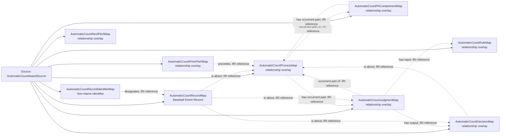

<!-- Generated by scripts/generate_rml_mermaid.py; do not edit. -->
<!-- Mapping SHA-256: 8c345042ecb2958d80d8fed5ce06613c31a202b499d928f3fbad5f6be2d4170c -->

# Automatic count awards without pitches - MLB game RML

An evidenced timer penalty contributes one counted Ball or Strike Process, with a distinct judgment, decision and source record; it contributes no Pitch Act.

Solid relation arrows are explicit parent-triples-map joins. Dotted arrows match IRI templates or IRI-valued references within the same logical source. Cross-pattern targets are listed in the table rather than drawn. Unresolved dynamic resource types remain generic; the accepted design supplies their reviewed interpretation.

## Logical sources

| Source | Execution file | JSONPath iterator | Maps in this review |
| --- | --- | --- | ---: |
| `AutomaticCountAwardSource` | `game-context.json` | `$._baseballO.metricAutomaticAwards[*]` | 9 |

## Triples maps

| Triples map | Subject class | Emitted relations | Cross-pattern targets |
| --- | --- | --- | --- |
| `AutomaticCountProcessMap` | relationship overlay | has occurrent part, occurrent part of, type | type -> Referenced resource (IRI reference) |
| `AutomaticCountPAContainmentMap` | relationship overlay | has occurrent part | none |
| `AutomaticCountJudgmentMap` | relationship overlay | has input, has output, occurrent part of, type | type -> Referenced resource (IRI reference) |
| `AutomaticCountDecisionMap` | relationship overlay | is about, type | type -> Referenced resource (IRI reference) |
| `AutomaticCountRuleMap` | relationship overlay | type | type -> Referenced resource (IRI reference) |
| `AutomaticCountRecordMap` | Baseball Event Record | has text value, is about | none |
| `AutomaticCountRecordIdentifierMap` | Non-Name Identifier | designates, has text value | none |
| `AutomaticCountPriorPitchMap` | relationship overlay | precedes | none |
| `AutomaticCountNextPitchMap` | relationship overlay | precedes | precedes -> Referenced resource (IRI reference) |
