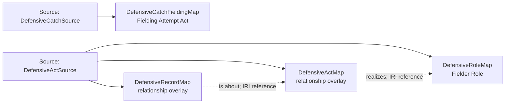

<!-- Generated by scripts/generate_rml_mermaid.py; do not edit. -->
<!-- Mapping SHA-256: b89377d634df094aef78de708e811ac44b66284dbbc0ba86bb21cde578077127 -->

# Source-supported defensive performances - MLB game RML

Distinct described performances have actual agents and their persistent Fielder Roles within a batted-ball play. Catch attempts retain one identity under fielding superclass typing. Narrative serialization does not assert precedence.

Solid relation arrows are explicit parent-triples-map joins. Dotted arrows match IRI templates or IRI-valued references within the same logical source. Cross-pattern targets are listed in the table rather than drawn. Unresolved dynamic resource types remain generic; the accepted design supplies their reviewed interpretation.

## Logical sources

| Source | Execution file | JSONPath iterator | Maps in this review |
| --- | --- | --- | ---: |
| `DefensiveActSource` | `game-context.json` | `$._baseballO.defensiveActs[*]` | 3 |
| `DefensiveCatchSource` | `game-context.json` | `$._baseballO.defensiveActs[?(@.catch == true)]` | 1 |

## Triples maps

| Triples map | Subject class | Emitted relations | Cross-pattern targets |
| --- | --- | --- | --- |
| `DefensiveActMap` | relationship overlay | has agent, occurrent part of, realizes, type | has agent -> Referenced resource (IRI reference), occurrent part of -> Referenced resource (IRI reference), type -> Referenced resource (IRI reference) |
| `DefensiveCatchFieldingMap` | Fielding Attempt Act | type assertion only | none |
| `DefensiveRoleMap` | Fielder Role | inheres in | inheres in -> Referenced resource (IRI reference) |
| `DefensiveRecordMap` | relationship overlay | is about | none |
