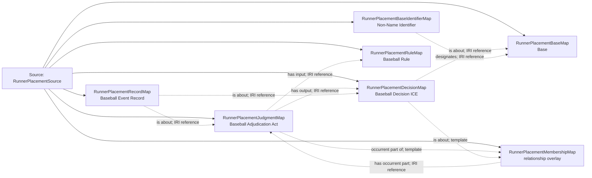

<!-- Generated by scripts/generate_rml_mermaid.py; do not edit. -->
<!-- Mapping SHA-256: bed3f052e82a896b8529c67b8e2a5c9746b06eef0788276d70bec48335fb63a4 -->

# Distinct extra-inning placement adjudication - MLB game RML

A placement judgment begins the personal history, including one with no movement. Its decision concerns that whole, runner and second base; it is never a running act, Safe judgment or credited advance.

Solid relation arrows are explicit parent-triples-map joins. Dotted arrows match IRI templates or IRI-valued references within the same logical source. Cross-pattern targets are listed in the table rather than drawn. Unresolved dynamic resource types remain generic; the accepted design supplies their reviewed interpretation.

## Logical sources

| Source | Execution file | JSONPath iterator | Maps in this review |
| --- | --- | --- | ---: |
| `RunnerPlacementSource` | `game-context.json` | `$._baseballO.runnerHistoryReconciliation.placementAdjudications[*]` | 7 |

## Triples maps

| Triples map | Subject class | Emitted relations | Cross-pattern targets |
| --- | --- | --- | --- |
| `RunnerPlacementJudgmentMap` | Baseball Adjudication Act | has input, has output, occurrent part of | none |
| `RunnerPlacementMembershipMap` | relationship overlay | has occurrent part | none |
| `RunnerPlacementDecisionMap` | Baseball Decision ICE | is about | is about -> PlateAppearanceStartRunnerLocationMap (template) |
| `RunnerPlacementBaseMap` | Base | type assertion only | none |
| `RunnerPlacementBaseIdentifierMap` | Non-Name Identifier | designates, has text value | none |
| `RunnerPlacementRuleMap` | Baseball Rule | type assertion only | none |
| `RunnerPlacementRecordMap` | Baseball Event Record | is about | none |
