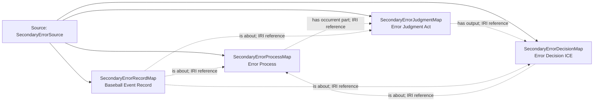

<!-- Generated by scripts/generate_rml_mermaid.py; do not edit. -->
<!-- Mapping SHA-256: cd4dda606e44e73c44bc725fccbd6e1b1ec28760bc7c60e9512e2eef68e0d508 -->

# Secondary scored errors - MLB game RML

Accepted EG4/EG5 scoring decisions remain distinct from actual participation and physical causation.

Solid relation arrows are explicit parent-triples-map joins. Dotted arrows match IRI templates or IRI-valued references within the same logical source. Cross-pattern targets are listed in the table rather than drawn. Unresolved dynamic resource types remain generic; the accepted design supplies their reviewed interpretation.

## Logical sources

| Source | Execution file | JSONPath iterator | Maps in this review |
| --- | --- | --- | ---: |
| `SecondaryErrorSource` | `game-context.json` | `$._baseballO.secondaryErrors[*]` | 4 |

## Triples maps

| Triples map | Subject class | Emitted relations | Cross-pattern targets |
| --- | --- | --- | --- |
| `SecondaryErrorProcessMap` | Error Process | has occurrent part | none |
| `SecondaryErrorJudgmentMap` | Error Judgment Act | has input, has output | has input -> ErrorRuleMap (template) |
| `SecondaryErrorDecisionMap` | Error Decision ICE | is about | none |
| `SecondaryErrorRecordMap` | Baseball Event Record | is about | is about -> Referenced resource (IRI reference) |
