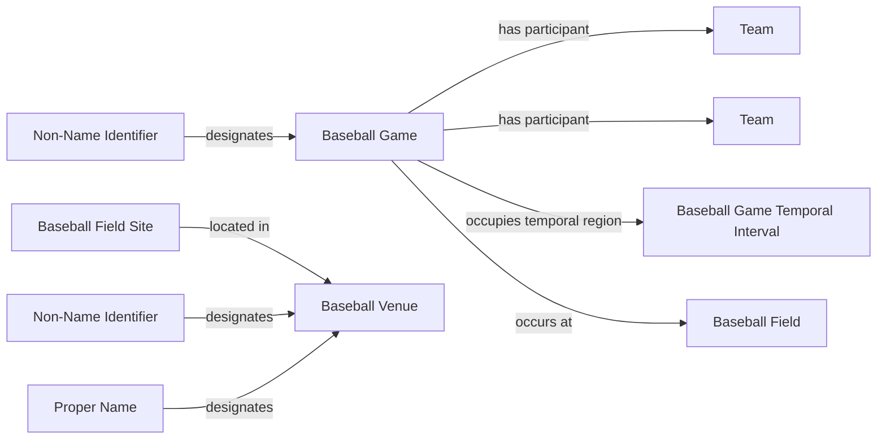

<!-- Generated by scripts/generate_rml_mermaid.py; do not edit. -->
<!-- Mapping SHA-256: ef70601419120731d914fe59980ec1dbefa4ce070f2bbca8ce5b46dbea3cb112 -->

# Game and venue

A baseball game occurs at a baseball-field site associated with a venue and is designated by a source identifier.

This view shows the ontology pattern without MLB JSON paths or RML machinery.

## RML evidence boundary

Generated from: `GameMap`, `GameIdentifierMap`, `VenueMap`, `VenueIdentifierMap`, `VenueNameMap`, `BaseballFieldSiteMap`.
