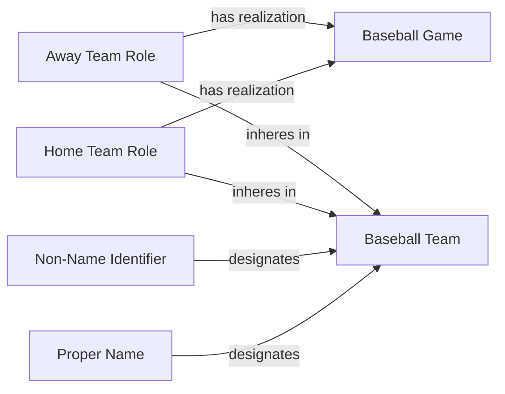

<!-- Generated by scripts/generate_rml_mermaid.py; do not edit. -->
<!-- Mapping SHA-256: 897a41688f0cd36aa8d0b3a8112c132b2c4a4f3e779505192f51b33870df8cea -->

# Team participation

Home and away teams participate in a game while their contextual team roles remain distinct from the teams themselves.

This view shows the ontology pattern without MLB JSON paths or RML machinery.

## RML evidence boundary

Generated from: `AwayTeamMap`, `AwayTeamIdentifierMap`, `AwayTeamNameMap`, `AwayTeamRoleMap`, `HomeTeamMap`, `HomeTeamIdentifierMap`, `HomeTeamNameMap`, `HomeTeamRoleMap`.
