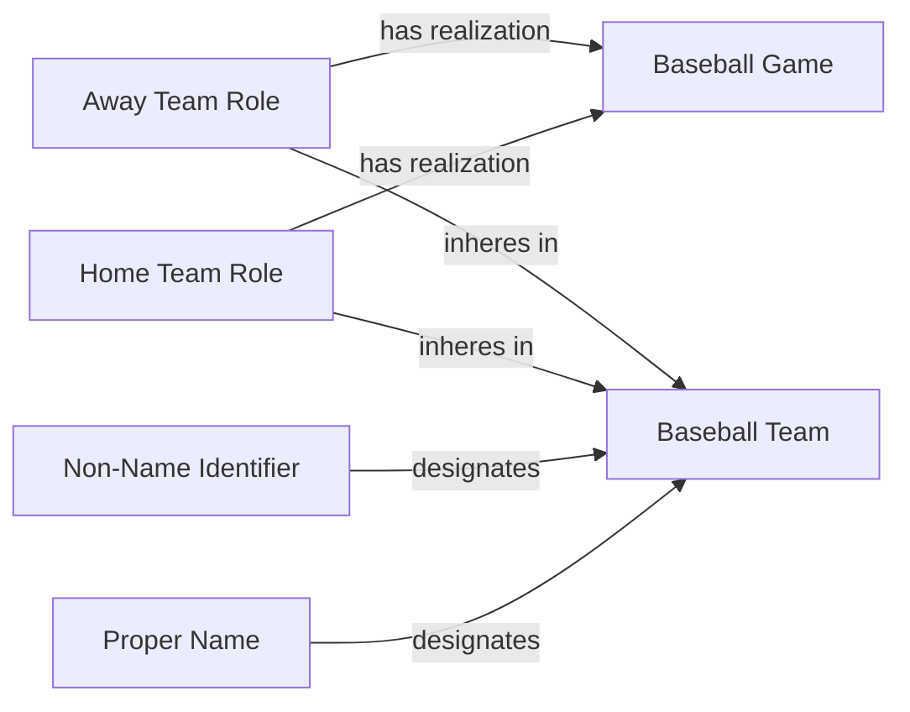

<!-- Generated by scripts/generate_rml_mermaid.py; do not edit. -->
<!-- Mapping SHA-256: 0525c6bf4b5afe22d7f8ed5ae6ba27fe96831e3a0765c0c3bf5a615539bc1189 -->

# Team participation

Home and away teams participate in a game while their contextual team roles remain distinct from the teams themselves.

This view shows the ontology pattern without MLB JSON paths or RML machinery.

## RML evidence boundary

Generated from: `AwayTeamMap`, `AwayTeamIdentifierMap`, `AwayTeamNameMap`, `AwayTeamRoleMap`, `HomeTeamMap`, `HomeTeamIdentifierMap`, `HomeTeamNameMap`, `HomeTeamRoleMap`.
