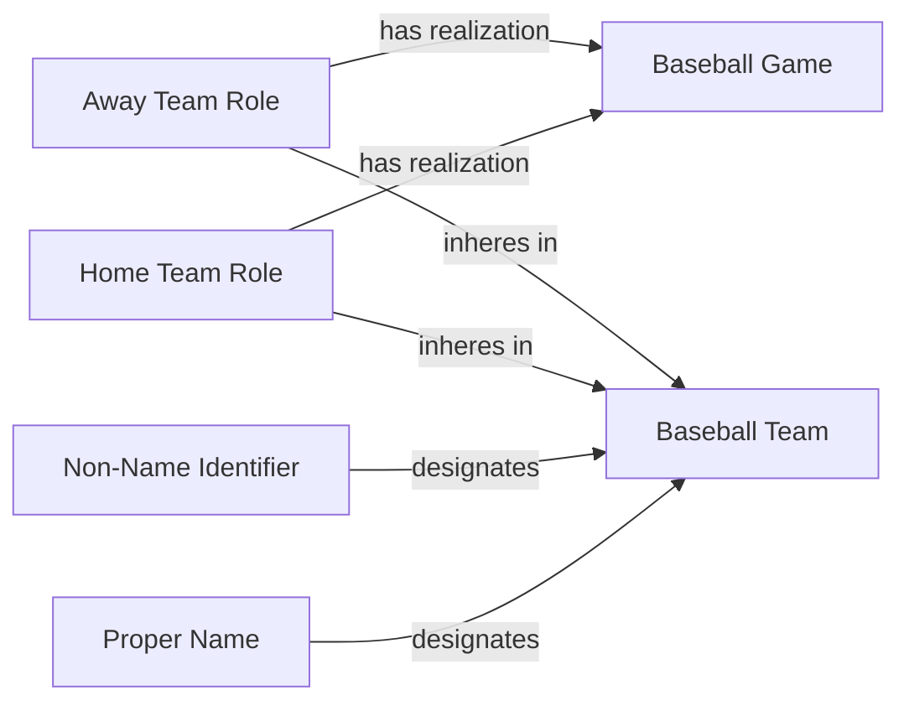

<!-- Generated by scripts/generate_rml_mermaid.py; do not edit. -->
<!-- Mapping SHA-256: cd4dda606e44e73c44bc725fccbd6e1b1ec28760bc7c60e9512e2eef68e0d508 -->

# Team participation

Home and away teams participate in a game while their contextual team roles remain distinct from the teams themselves.

This view shows the ontology pattern without MLB JSON paths or RML machinery.

```mermaid
flowchart LR
    N01["Baseball Game"]
    N02["Away Team Role"]
    N03["Home Team Role"]
    N04["Baseball Team"]
    N05["Non-Name Identifier"]
    N06["Proper Name"]
    N02 -->|has realization| N01
    N02 -->|inheres in| N04
    N03 -->|has realization| N01
    N03 -->|inheres in| N04
    N05 -->|designates| N04
    N06 -->|designates| N04
```

## RML evidence boundary

Generated from: `AwayTeamMap`, `AwayTeamIdentifierMap`, `AwayTeamNameMap`, `AwayTeamRoleMap`, `HomeTeamMap`, `HomeTeamIdentifierMap`, `HomeTeamNameMap`, `HomeTeamRoleMap`.
