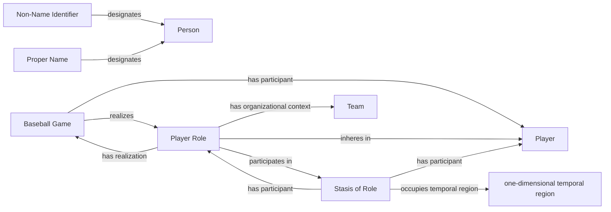

<!-- Generated by scripts/generate_rml_mermaid.py; do not edit. -->
<!-- Mapping SHA-256: 475f4c47f3b0bb3941dc4380421823ad817aec29e827ff53c3a606a354c62018 -->

# Player identity

Every accepted player participates in the game and bears a team-scoped PlayerRole that the game realizes, including players who remain on the bench; the role participates in an open role stasis.

This view shows the ontology pattern without MLB JSON paths or RML machinery.

## RML evidence boundary

Generated from: `PlayerMap`, `PlayerIdentifierMap`, `PlayerNameMap`, `PlayerRoleMap`, `GamePlayerTeamRoleRealizationMap`, `PlayerRoleStasisMap`, `PlayerRoleStasisIntervalMap`.
