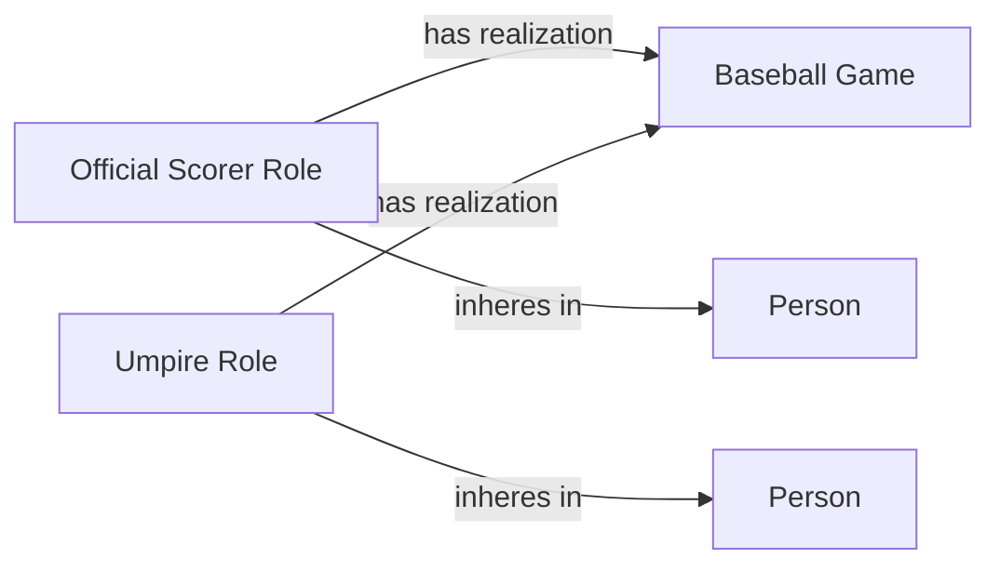

<!-- Generated by scripts/generate_rml_mermaid.py; do not edit. -->
<!-- Mapping SHA-256: afc5ccb32c5b86811c4960eda0c0809e2e3daaa57d51b4d067d7b54dc4b6e50c -->

# Game officials

Umpires and the official scorer are persons bearing game-scoped roles.

This view shows the ontology pattern without MLB JSON paths or RML machinery.

## RML evidence boundary

Generated from: `UmpirePersonMap`, `UmpireRoleMap`, `OfficialScorerPersonMap`, `OfficialScorerRoleMap`.
