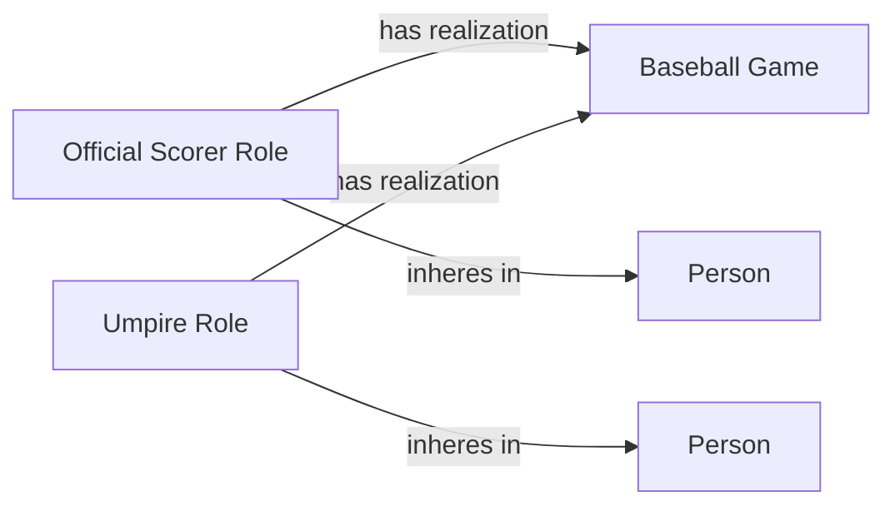

<!-- Generated by scripts/generate_rml_mermaid.py; do not edit. -->
<!-- Mapping SHA-256: ab85db49a66adbcba8c5e82535e3a1824626785795b7c5e3eb7169676c38b3d0 -->

# Game officials

Umpires and the official scorer are persons bearing game-scoped roles.

This view shows the ontology pattern without MLB JSON paths or RML machinery.

## RML evidence boundary

Generated from: `UmpirePersonMap`, `UmpireRoleMap`, `OfficialScorerPersonMap`, `OfficialScorerRoleMap`.
