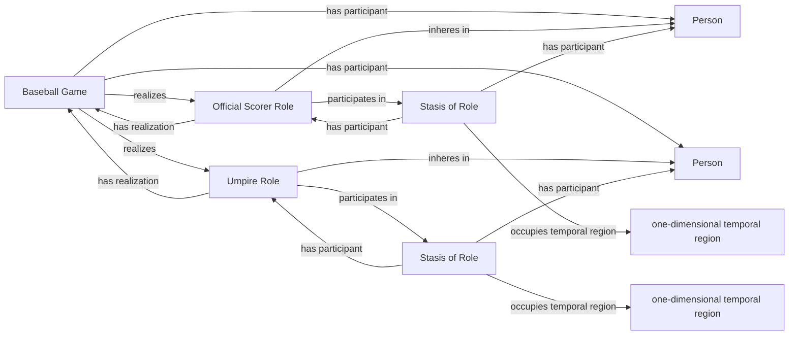

<!-- Generated by scripts/generate_rml_mermaid.py; do not edit. -->
<!-- Mapping SHA-256: ef70601419120731d914fe59980ec1dbefa4ce070f2bbca8ce5b46dbea3cb112 -->

# Game officials

Umpires and the official scorer bear persistent adjudicator roles that the game realizes and that participate in open role stases.

This view shows the ontology pattern without MLB JSON paths or RML machinery.

## RML evidence boundary

Generated from: `UmpirePersonMap`, `UmpireRoleMap`, `GameUmpireCareerRealizationMap`, `UmpireRoleStasisMap`, `UmpireRoleStasisIntervalMap`, `OfficialScorerPersonMap`, `OfficialScorerRoleMap`, `GameOfficialScorerCareerRealizationMap`, `OfficialScorerRoleStasisMap`, `OfficialScorerRoleStasisIntervalMap`.
