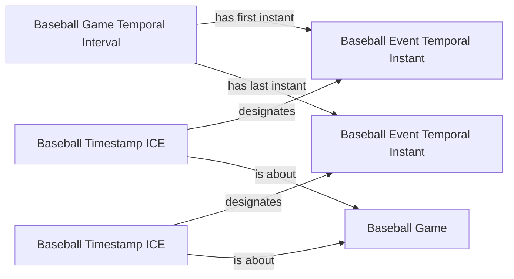

<!-- Generated by scripts/generate_rml_mermaid.py; do not edit. -->
<!-- Mapping SHA-256: 0525c6bf4b5afe22d7f8ed5ae6ba27fe96831e3a0765c0c3bf5a615539bc1189 -->

# Game temporal region

A game occupies an interval bounded by temporal instants that are designated by timestamp information.

This view shows the ontology pattern without MLB JSON paths or RML machinery.

## RML evidence boundary

Generated from: `GameTemporalIntervalMap`, `GameStartInstantMap`, `GameStartTimestampMap`, `GameEndInstantMap`, `GameEndTimestampMap`.
