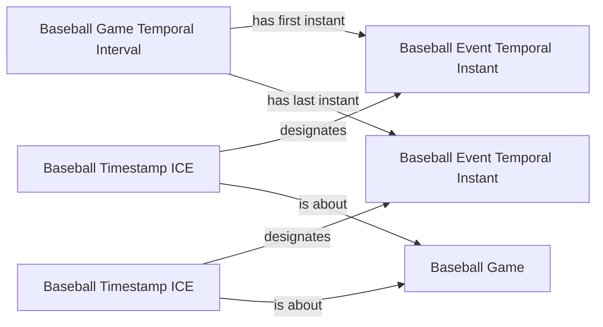

<!-- Generated by scripts/generate_rml_mermaid.py; do not edit. -->
<!-- Mapping SHA-256: cd4dda606e44e73c44bc725fccbd6e1b1ec28760bc7c60e9512e2eef68e0d508 -->

# Game temporal region

A game occupies an interval bounded by temporal instants that are designated by timestamp information.

This view shows the ontology pattern without MLB JSON paths or RML machinery.

```mermaid
flowchart LR
    N01["Baseball Game"]
    N02["Baseball Event Temporal Instant"]
    N03["Baseball Event Temporal Instant"]
    N04["Baseball Game Temporal Interval"]
    N05["Baseball Timestamp ICE"]
    N06["Baseball Timestamp ICE"]
    N04 -->|has first instant| N03
    N04 -->|has last instant| N02
    N05 -->|designates| N02
    N05 -->|is about| N01
    N06 -->|designates| N03
    N06 -->|is about| N01
```

## RML evidence boundary

Generated from: `GameTemporalIntervalMap`, `GameStartInstantMap`, `GameStartTimestampMap`, `GameEndInstantMap`, `GameEndTimestampMap`.
