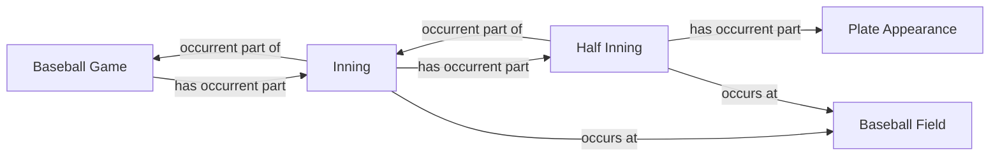

<!-- Generated by scripts/generate_rml_mermaid.py; do not edit. -->
<!-- Mapping SHA-256: bed3f052e82a896b8529c67b8e2a5c9746b06eef0788276d70bec48335fb63a4 -->

# Game containment

Game, inning, half inning, and plate appearance form an explicit occurrent-part hierarchy.

This view shows the ontology pattern without MLB JSON paths or RML machinery.

## RML evidence boundary

Generated from: `GameInningContainmentMap`, `InningMap`, `InningHalfInningContainmentMap`, `HalfInningMap`, `HalfInningPlateAppearanceContainmentMap`.
