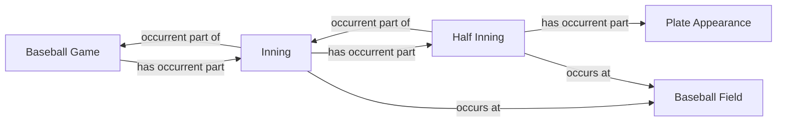

<!-- Generated by scripts/generate_rml_mermaid.py; do not edit. -->
<!-- Mapping SHA-256: 475f4c47f3b0bb3941dc4380421823ad817aec29e827ff53c3a606a354c62018 -->

# Game containment

Game, inning, half inning, and plate appearance form an explicit occurrent-part hierarchy.

This view shows the ontology pattern without MLB JSON paths or RML machinery.

## RML evidence boundary

Generated from: `GameInningContainmentMap`, `InningMap`, `InningHalfInningContainmentMap`, `HalfInningMap`, `HalfInningPlateAppearanceContainmentMap`.
