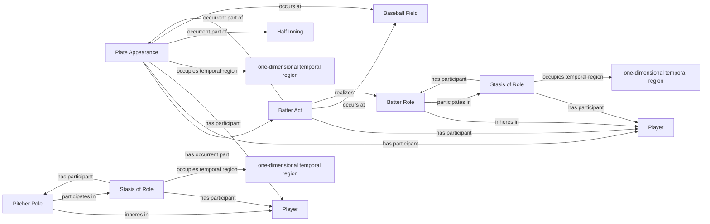

<!-- Generated by scripts/generate_rml_mermaid.py; do not edit. -->
<!-- Mapping SHA-256: bca42ec534c9be7569f69d0fa65d49406cb4139125c1720503fdd2756abefb40 -->

# Plate appearance and player acts

A plate appearance contains a batter act and pitch acts, with batter and pitcher persons participating through contextual roles.

This view shows the ontology pattern without MLB JSON paths or RML machinery.

## RML evidence boundary

Generated from: `PlateAppearanceMap`, `PlateAppearanceCoreContainmentMap`, `BatterActMap`, `BatterRoleMap`, `BatterRoleStasisMap`, `BatterRoleStasisIntervalMap`, `PitcherRoleMap`, `PitcherRoleStasisMap`, `PitcherRoleStasisIntervalMap`.
