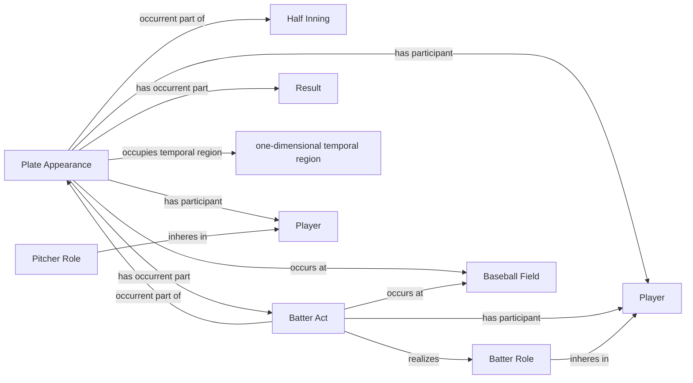

<!-- Generated by scripts/generate_rml_mermaid.py; do not edit. -->
<!-- Mapping SHA-256: ca2bfcd3533f154819be7138ce97981ad9af101d0152bc154d5eac8049dde31a -->

# Plate appearance and player acts

A plate appearance contains a batter act and pitch acts, with batter and pitcher persons participating through contextual roles.

This view shows the ontology pattern without MLB JSON paths or RML machinery.

## RML evidence boundary

Generated from: `PlateAppearanceMap`, `PlateAppearanceCoreContainmentMap`, `BatterActMap`, `BatterRoleMap`, `PitcherRoleMap`.
