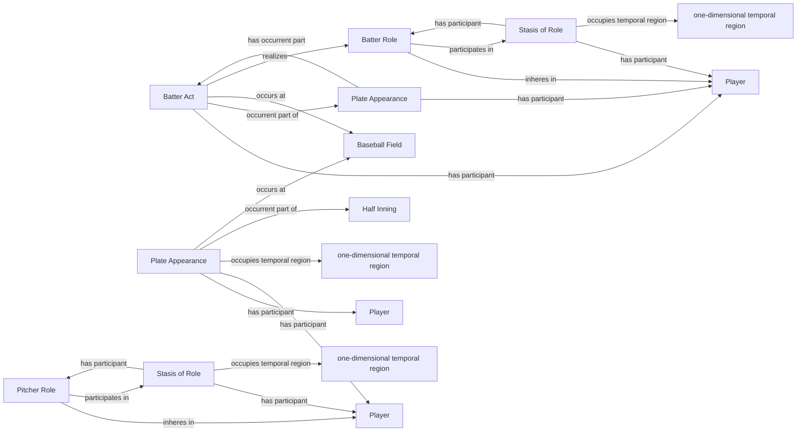

<!-- Generated by scripts/generate_rml_mermaid.py; do not edit. -->
<!-- Mapping SHA-256: 9dda8b5110491293e9b7c93625275eca382790b5a0be0147b2781cea4a2d4a47 -->

# Plate appearance and player acts

A plate appearance contains distinct Batter Acts for each actual uninterrupted batting participant, reusing persistent Batter Roles; actual participation remains separate from official statistical PA credit.

This view shows the ontology pattern without MLB JSON paths or RML machinery.

## RML evidence boundary

Generated from: `PlateAppearanceMap`, `PlateAppearanceCoreContainmentMap`, `BatterActMap`, `BatterRoleMap`, `BatterRoleStasisMap`, `BatterRoleStasisIntervalMap`, `PitcherRoleMap`, `PitcherRoleStasisMap`, `PitcherRoleStasisIntervalMap`.
