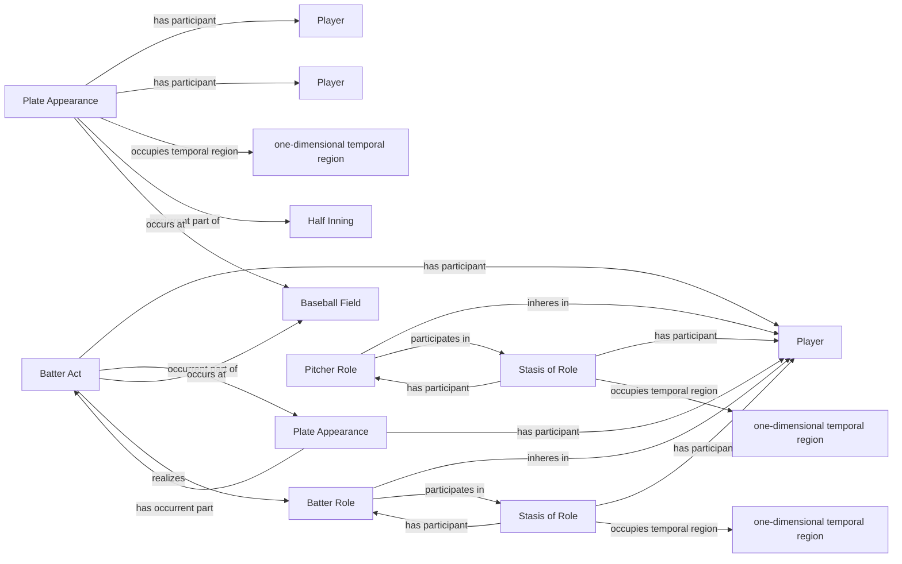

<!-- Generated by scripts/generate_rml_mermaid.py; do not edit. -->
<!-- Mapping SHA-256: 453de892549be95019b4529f875fbd86bd7bd073b32261dd717a096007cf3413 -->

# Plate appearance and player acts

A plate appearance contains distinct Batter Acts for each actual uninterrupted batting participant, reusing persistent Batter Roles; actual participation remains separate from official statistical PA credit.

This view shows the ontology pattern without MLB JSON paths or RML machinery.

```mermaid
flowchart LR
    N01["Batter Act"]
    N02["Half Inning"]
    N03["Plate Appearance"]
    N04["one-dimensional temporal region"]
    N05["Plate Appearance"]
    N06["Player"]
    N07["Player"]
    N08["Player"]
    N09["Batter Role"]
    N10["Stasis of Role"]
    N11["one-dimensional temporal region"]
    N12["Pitcher Role"]
    N13["Stasis of Role"]
    N14["one-dimensional temporal region"]
    N15["Baseball Field"]
    N01 -->|has participant| N08
    N01 -->|occurrent part of| N05
    N01 -->|occurs at| N15
    N01 -->|realizes| N09
    N03 -->|has participant| N06
    N03 -->|has participant| N07
    N03 -->|occupies temporal region| N04
    N03 -->|occurrent part of| N02
    N03 -->|occurs at| N15
    N05 -->|has occurrent part| N01
    N05 -->|has participant| N08
    N09 -->|inheres in| N08
    N09 -->|participates in| N10
    N10 -->|has participant| N08
    N10 -->|has participant| N09
    N10 -->|occupies temporal region| N11
    N12 -->|inheres in| N08
    N12 -->|participates in| N13
    N13 -->|has participant| N08
    N13 -->|has participant| N12
    N13 -->|occupies temporal region| N14
```

## RML evidence boundary

Generated from: `PlateAppearanceMap`, `PlateAppearanceCoreContainmentMap`, `BatterActMap`, `BatterRoleMap`, `BatterRoleStasisMap`, `BatterRoleStasisIntervalMap`, `PitcherRoleMap`, `PitcherRoleStasisMap`, `PitcherRoleStasisIntervalMap`, `PlateAppearancePitcherParticipantMap`.
