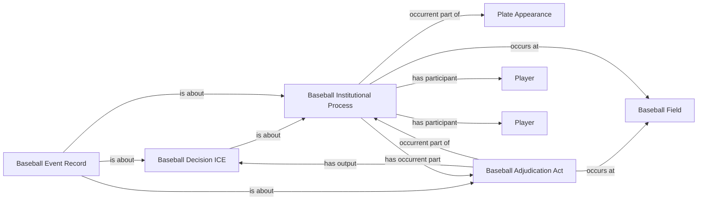

<!-- Generated by scripts/generate_rml_mermaid.py; do not edit. -->
<!-- Mapping SHA-256: 57a5cb1a54e46ee26b27f101cb1468292932df060b1f72c51331c0d029f8c2b5 -->

# Plate appearance result and adjudication

Every plate-appearance result is a distinct institutional process with an adjudication act, decision, and event record.

This view shows the ontology pattern without MLB JSON paths or RML machinery.

## RML evidence boundary

Generated from: `PlateAppearanceResultMap`, `PlateAppearanceResultJudgmentMap`, `PlateAppearanceResultDecisionMap`, `PlateAppearanceResultRecordMap`, `PlateAppearanceResultRecordAdjudicationMap`.
