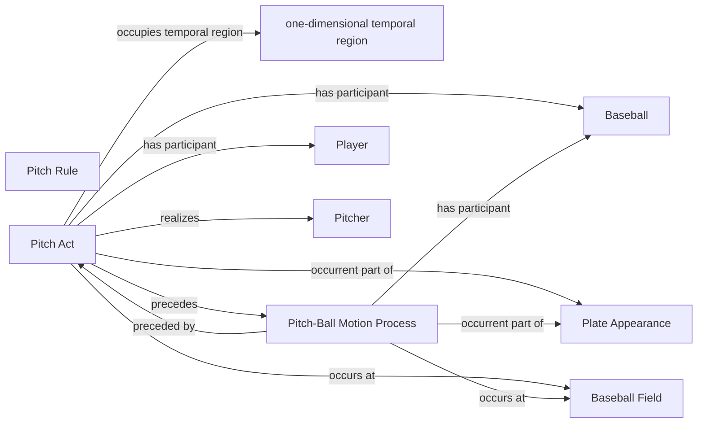

<!-- Generated by scripts/generate_rml_mermaid.py; do not edit. -->
<!-- Mapping SHA-256: 897a41688f0cd36aa8d0b3a8112c132b2c4a4f3e779505192f51b33870df8cea -->

# Pitch physical chain

A pitch act precedes a pitch-ball-motion process involving a pitch-scoped baseball and governed by the pitch rule.

This view shows the ontology pattern without MLB JSON paths or RML machinery.

## RML evidence boundary

Generated from: `PitchActMap`, `PitchActPhysicalOverlayMap`, `PitchBallMotionMap`, `PitchBaseballMap`, `PitchRuleMap`.
