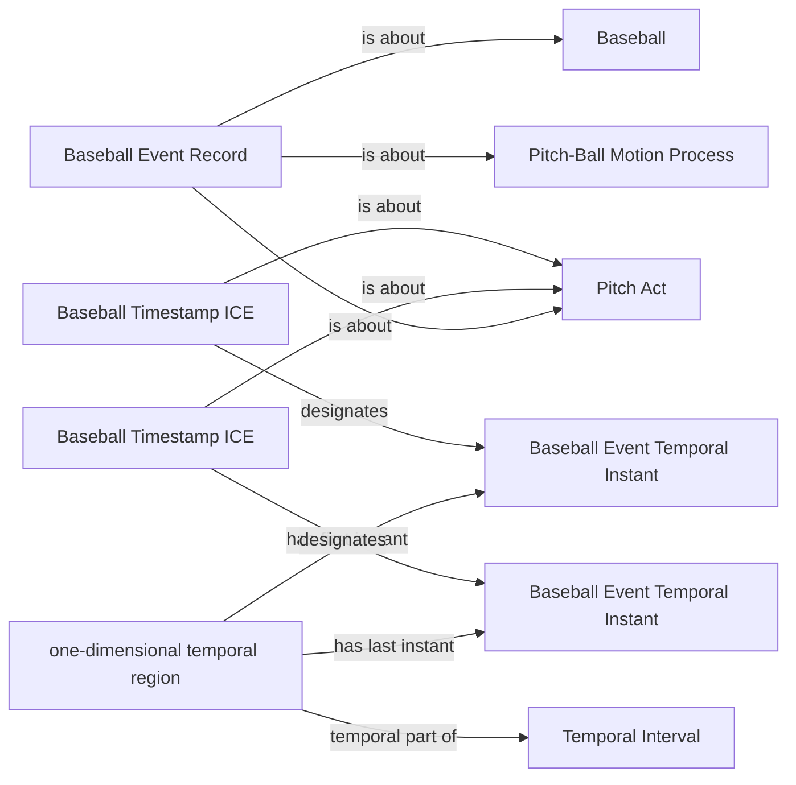

<!-- Generated by scripts/generate_rml_mermaid.py; do not edit. -->
<!-- Mapping SHA-256: 0525c6bf4b5afe22d7f8ed5ae6ba27fe96831e3a0765c0c3bf5a615539bc1189 -->

# Pitch time and record

A pitch occupies a temporal interval, has timestamped endpoints, and is described by a separate event record.

This view shows the ontology pattern without MLB JSON paths or RML machinery.

## RML evidence boundary

Generated from: `PitchEventRecordMap`, `PitchIntervalMap`, `PitchStartInstantMap`, `PitchStartTimestampMap`, `PitchEndInstantMap`, `PitchEndTimestampMap`, `PitchPhysicalRecordAboutMap`.
