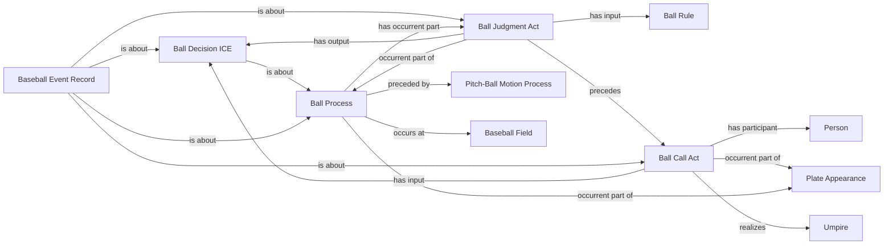

<!-- Generated by scripts/generate_rml_mermaid.py; do not edit. -->
<!-- Mapping SHA-256: 9dda8b5110491293e9b7c93625275eca382790b5a0be0147b2781cea4a2d4a47 -->

# Called ball adjudication

A ball process follows pitch motion and contains a judgment that produces a decision used by a call act; ball-in-dirt is a source-supported variant.

This view shows the ontology pattern without MLB JSON paths or RML machinery.

## RML evidence boundary

Generated from: `BallProcessMap`, `BallProcessMapRecordAboutMap`, `BallInDirtProcessMap`, `BallInDirtProcessMapRecordAboutMap`, `BallProcessAdjudicationOverlayMap`, `BallJudgmentMap`, `BallDecisionMap`, `BallCallMap`, `BallAdjudicationRecordMap`, `BallRuleMap`.
