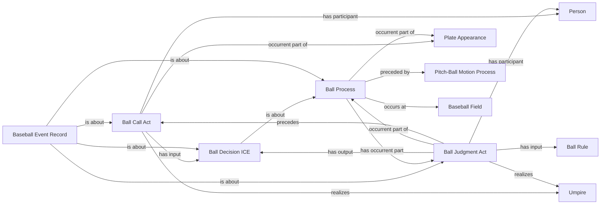

<!-- Generated by scripts/generate_rml_mermaid.py; do not edit. -->
<!-- Mapping SHA-256: 01f3efbccd0d2691d2b9ea22d2976ccca3e092a05a923e48639427281ac4ce8b -->

# Called ball adjudication

A ball process follows pitch motion and contains a judgment that produces a decision used by a call act; ball-in-dirt is a source-supported variant.

This view shows the ontology pattern without MLB JSON paths or RML machinery.

## RML evidence boundary

Generated from: `BallProcessMap`, `BallProcessMapRecordAboutMap`, `BallInDirtProcessMap`, `BallInDirtProcessMapRecordAboutMap`, `BallProcessAdjudicationOverlayMap`, `BallJudgmentMap`, `BallDecisionMap`, `BallCallMap`, `BallAdjudicationRecordMap`, `BallRuleMap`.
