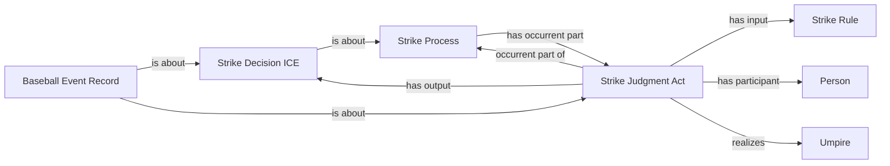

<!-- Generated by scripts/generate_rml_mermaid.py; do not edit. -->
<!-- Mapping SHA-256: ca2bfcd3533f154819be7138ce97981ad9af101d0152bc154d5eac8049dde31a -->

# Strike adjudication

Called and swinging strikes share a counted strike judgment and decision pattern while retaining distinct source-specific branches.

This view shows the ontology pattern without MLB JSON paths or RML machinery.

## RML evidence boundary

Generated from: `StrikeProcessAdjudicationOverlayMap`, `StrikeJudgmentMap`, `StrikeDecisionMap`, `StrikeAdjudicationRecordMap`, `StrikeRuleMap`.
