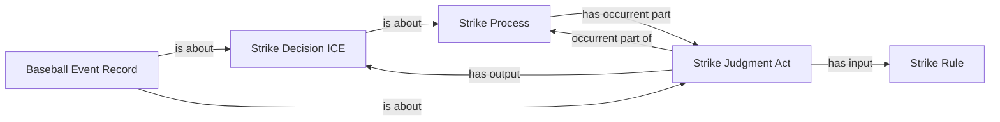

<!-- Generated by scripts/generate_rml_mermaid.py; do not edit. -->
<!-- Mapping SHA-256: 8c345042ecb2958d80d8fed5ce06613c31a202b499d928f3fbad5f6be2d4170c -->

# Strike adjudication

Called and swinging strikes share a counted strike judgment and decision pattern while retaining distinct source-specific branches.

This view shows the ontology pattern without MLB JSON paths or RML machinery.

## RML evidence boundary

Generated from: `StrikeProcessAdjudicationOverlayMap`, `StrikeJudgmentMap`, `StrikeDecisionMap`, `StrikeAdjudicationRecordMap`, `StrikeRuleMap`.
