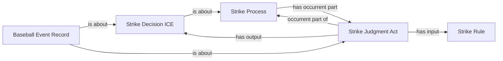

<!-- Generated by scripts/generate_rml_mermaid.py; do not edit. -->
<!-- Mapping SHA-256: cd4dda606e44e73c44bc725fccbd6e1b1ec28760bc7c60e9512e2eef68e0d508 -->

# Strike adjudication

Called and swinging strikes share a counted strike judgment and decision pattern while retaining distinct source-specific branches.

This view shows the ontology pattern without MLB JSON paths or RML machinery.

```mermaid
flowchart LR
    N01["Strike Rule"]
    N02["Strike Decision ICE"]
    N03["Strike Judgment Act"]
    N04["Baseball Event Record"]
    N05["Strike Process"]
    N02 -->|is about| N05
    N03 -->|has input| N01
    N03 -->|has output| N02
    N03 -->|occurrent part of| N05
    N04 -->|is about| N02
    N04 -->|is about| N03
    N05 -->|has occurrent part| N03
```

## RML evidence boundary

Generated from: `StrikeProcessAdjudicationOverlayMap`, `StrikeJudgmentMap`, `StrikeDecisionMap`, `StrikeAdjudicationRecordMap`, `StrikeRuleMap`.
