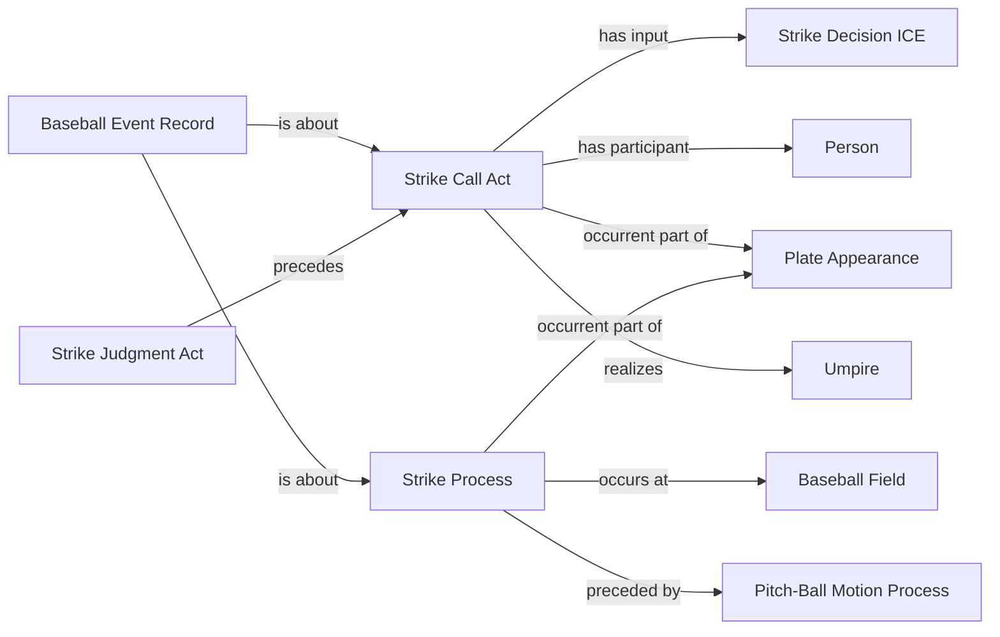

<!-- Generated by scripts/generate_rml_mermaid.py; do not edit. -->
<!-- Mapping SHA-256: ef70601419120731d914fe59980ec1dbefa4ce070f2bbca8ce5b46dbea3cb112 -->

# Called strike

A called strike process is followed by an explicit strike call act that consumes the strike decision.

This view shows the ontology pattern without MLB JSON paths or RML machinery.

## RML evidence boundary

Generated from: `CalledStrikeProcessMap`, `CalledStrikeProcessMapRecordAboutMap`, `CalledStrikeCallMap`, `CalledStrikeJudgmentCallSequenceMap`, `CalledStrikeRecordCallMap`.
