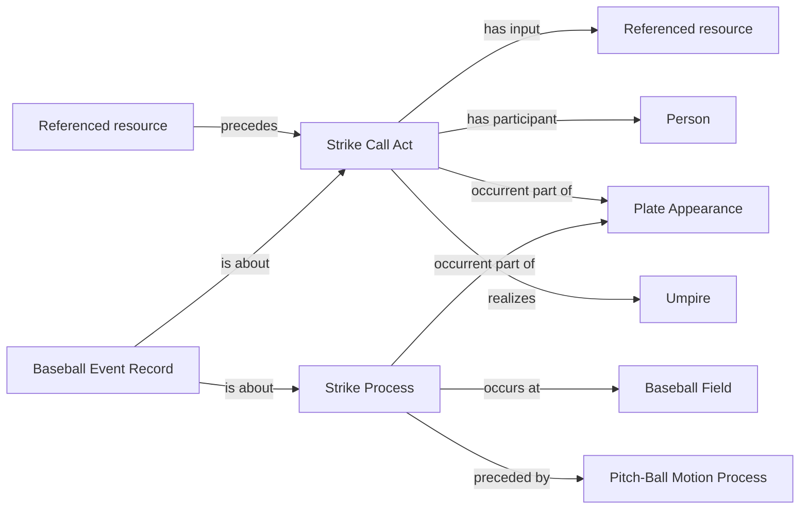

<!-- Generated by scripts/generate_rml_mermaid.py; do not edit. -->
<!-- Mapping SHA-256: 11be74814589051873cc48ee2c8577d3b1303ac7473b6114aa6740b30df96d0f -->

# Called strike

A called strike process is followed by an explicit strike call act that consumes the strike decision.

This view shows the ontology pattern without MLB JSON paths or RML machinery.

## RML evidence boundary

Generated from: `CalledStrikeProcessMap`, `CalledStrikeProcessMapRecordAboutMap`, `CalledStrikeCallMap`, `CalledStrikeJudgmentCallSequenceMap`, `CalledStrikeRecordCallMap`.
