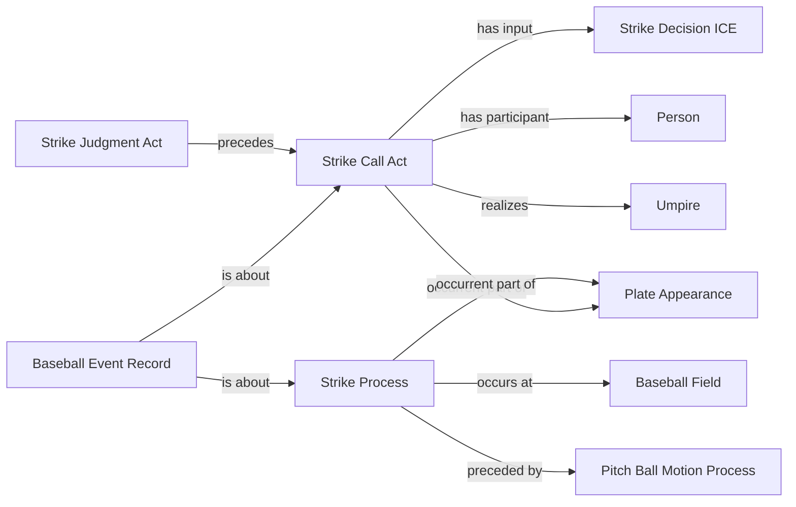

<!-- Generated by scripts/generate_rml_mermaid.py; do not edit. -->
<!-- Mapping SHA-256: 9a3db3cb5b1910df091581beef2527d2be68ec9d03699dce645c1b3a20bbe611 -->

# Called strike

A called strike process is followed by an explicit strike call act that consumes the strike decision.

This view shows the ontology pattern without MLB JSON paths or RML machinery.

## RML evidence boundary

Generated from: `CalledStrikeProcessMap`, `CalledStrikeProcessMapRecordAboutMap`, `CalledStrikeCallMap`, `CalledStrikeJudgmentCallSequenceMap`, `CalledStrikeRecordCallMap`.
