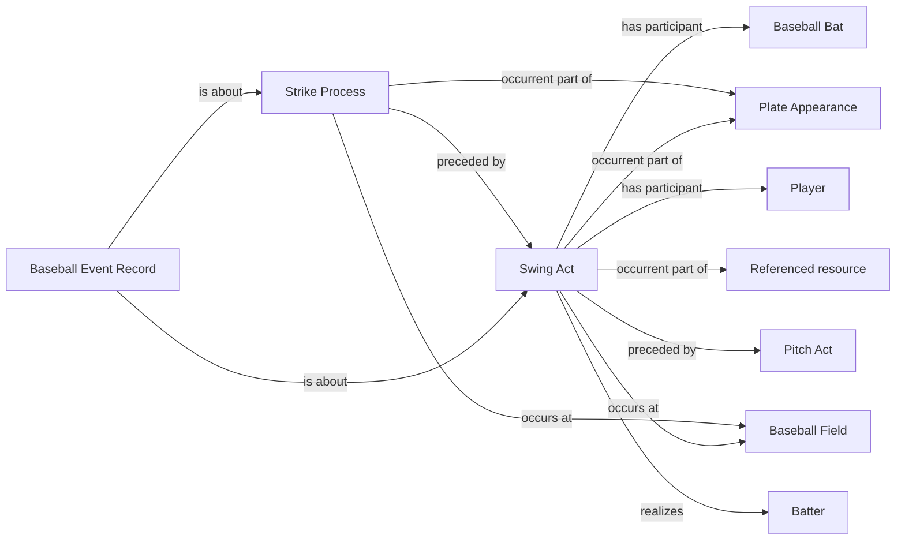

<!-- Generated by scripts/generate_rml_mermaid.py; do not edit. -->
<!-- Mapping SHA-256: 0525c6bf4b5afe22d7f8ed5ae6ba27fe96831e3a0765c0c3bf5a615539bc1189 -->

# Swinging strike without contact

A neutral swing act precedes the counted strike process; no distinct successful or unsuccessful swing class is minted.

This view shows the ontology pattern without MLB JSON paths or RML machinery.

## RML evidence boundary

Generated from: `SwingingStrikeSwingActMap`, `SwingingStrikeSwingActMapRecordAboutMap`, `SwingingStrikeProcessMap`, `SwingingStrikeProcessMapRecordAboutMap`.
