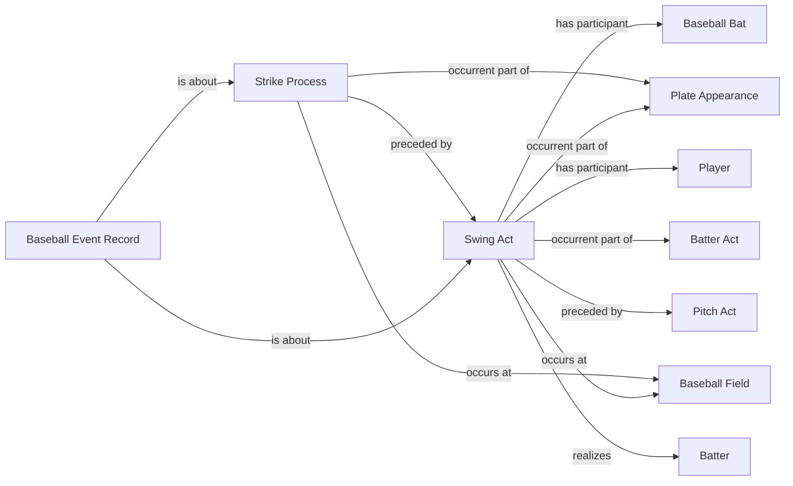

<!-- Generated by scripts/generate_rml_mermaid.py; do not edit. -->
<!-- Mapping SHA-256: ef70601419120731d914fe59980ec1dbefa4ce070f2bbca8ce5b46dbea3cb112 -->

# Swinging strike without contact

A neutral swing act precedes the counted strike process; no distinct successful or unsuccessful swing class is minted.

This view shows the ontology pattern without MLB JSON paths or RML machinery.

## RML evidence boundary

Generated from: `SwingingStrikeSwingActMap`, `SwingingStrikeSwingActMapRecordAboutMap`, `SwingingStrikeProcessMap`, `SwingingStrikeProcessMapRecordAboutMap`.
