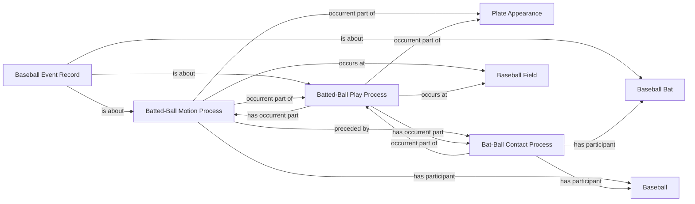

<!-- Generated by scripts/generate_rml_mermaid.py; do not edit. -->
<!-- Mapping SHA-256: 9a3db3cb5b1910df091581beef2527d2be68ec9d03699dce645c1b3a20bbe611 -->

# Batted-ball physical backbone

Contact and batted-ball motion are distinct physical processes contained in a batted-ball play and involving the ball and bat artifacts.

This view shows the ontology pattern without MLB JSON paths or RML machinery.

## RML evidence boundary

Generated from: `BattedBallPlayMap`, `BattedBallPlayRecordMap`, `BattedBallMotionMap`, `BattedBallMotionMapRecordAboutMap`, `BattedBallContactParticipantOverlayMap`, `BattedBallMotionParticipantOverlayMap`, `SwingBaseballBatMap`.
