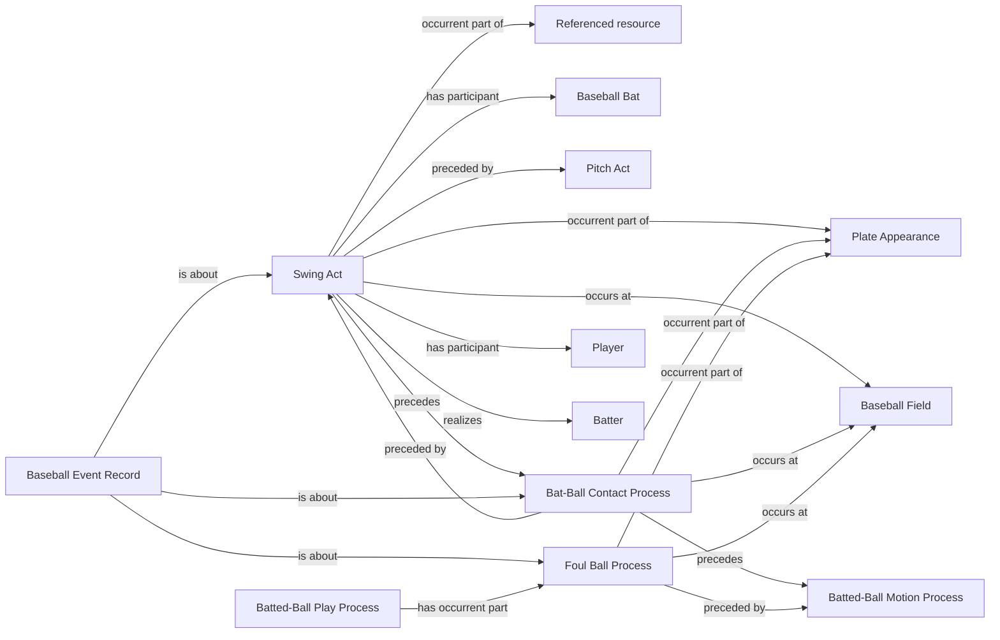

<!-- Generated by scripts/generate_rml_mermaid.py; do not edit. -->
<!-- Mapping SHA-256: 9dda8b5110491293e9b7c93625275eca382790b5a0be0147b2781cea4a2d4a47 -->

# Foul-ball physical chain

A swing and contact precede the foul-ball process, while the batted-ball play and event record retain the physical evidence.

This view shows the ontology pattern without MLB JSON paths or RML machinery.

## RML evidence boundary

Generated from: `FoulSwingActMap`, `FoulSwingActMapRecordAboutMap`, `FoulContactMap`, `FoulContactMapRecordAboutMap`, `FoulBallProcessMap`, `FoulBallProcessMapRecordAboutMap`, `BattedBallPlayFoulContainmentMap`.
