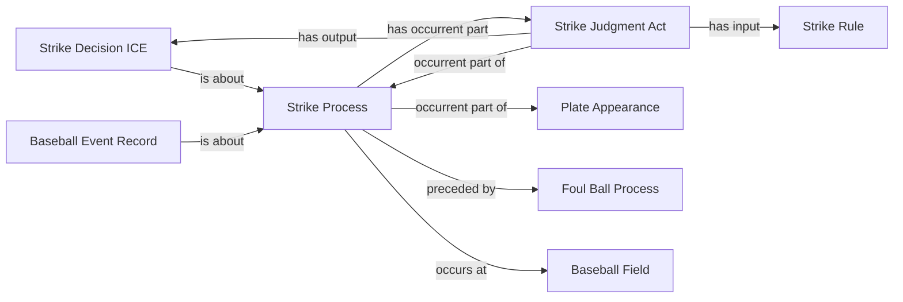

<!-- Generated by scripts/generate_rml_mermaid.py; do not edit. -->
<!-- Mapping SHA-256: ef70601419120731d914fe59980ec1dbefa4ce070f2bbca8ce5b46dbea3cb112 -->

# Counted foul strike

Where the event-local count is unambiguous, a foul contains a separately adjudicated counted strike process.

This view shows the ontology pattern without MLB JSON paths or RML machinery.

## RML evidence boundary

Generated from: `FoulStrikeProcessMap`, `FoulStrikeProcessMapRecordAboutMap`, `CountedFoulStrikeProcessPartMap`, `CountedFoulStrikeAdjudicationMap`, `CountedFoulStrikeDecisionMap`.
