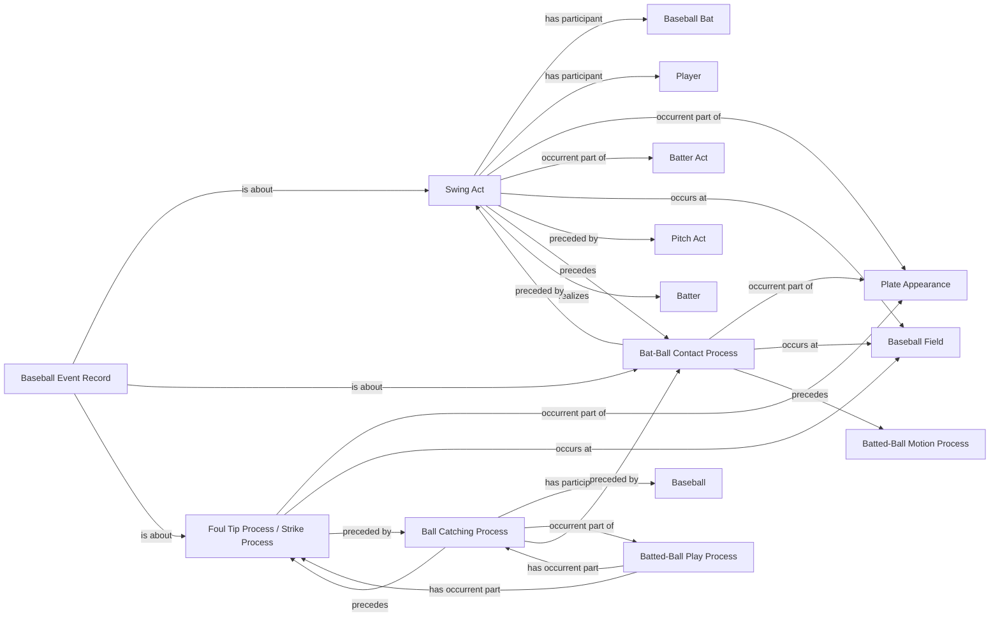

<!-- Generated by scripts/generate_rml_mermaid.py; do not edit. -->
<!-- Mapping SHA-256: ca2bfcd3533f154819be7138ce97981ad9af101d0152bc154d5eac8049dde31a -->

# Foul-tip physical chain and shared identity

A foul tip follows swing and contact, includes catching, and is one institutional-process individual typed as both foul tip and strike.

This view shows the ontology pattern without MLB JSON paths or RML machinery.

## RML evidence boundary

Generated from: `FoulTipSwingActMap`, `FoulTipSwingActMapRecordAboutMap`, `FoulTipContactMap`, `FoulTipContactMapRecordAboutMap`, `FoulTipBallCatchingMap`, `FoulTipProcessMap`, `FoulTipStrikeProcessMap`, `FoulTipProcessMapRecordAboutMap`, `FoulTipStrikeProcessMapRecordAboutMap`, `BattedBallPlayFoulTipContainmentMap`.
