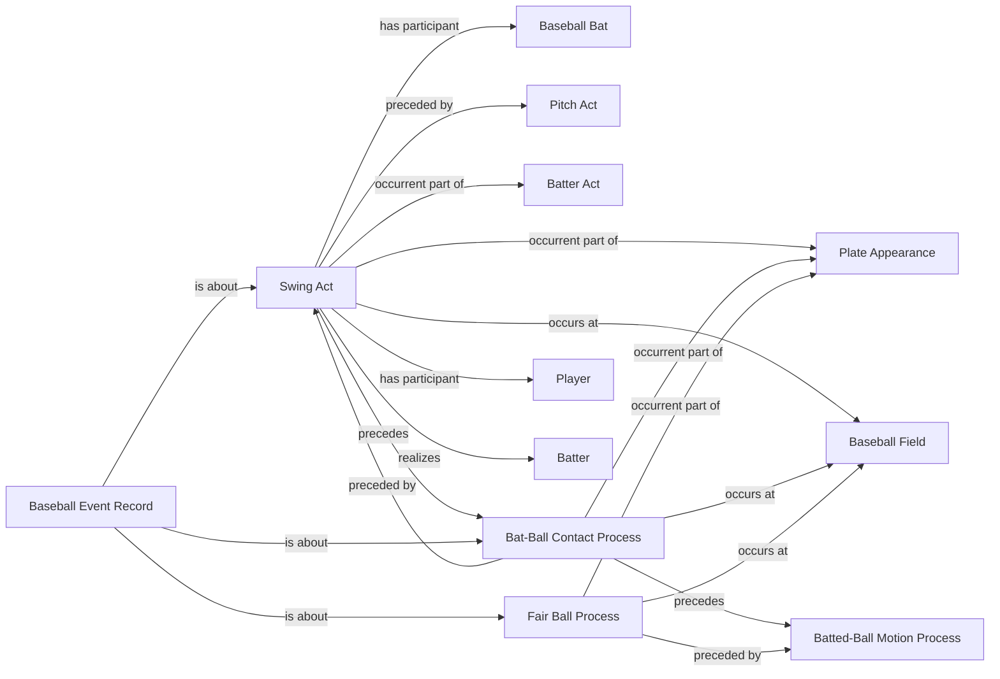

<!-- Generated by scripts/generate_rml_mermaid.py; do not edit. -->
<!-- Mapping SHA-256: ef70601419120731d914fe59980ec1dbefa4ce070f2bbca8ce5b46dbea3cb112 -->

# In-play out contact

A swing and contact precede a fair-ball process for an in-play event whose feed call is out.

This view shows the ontology pattern without MLB JSON paths or RML machinery.

## RML evidence boundary

Generated from: `InPlayOutSwingActMap`, `InPlayOutSwingActMapRecordAboutMap`, `InPlayOutContactMap`, `InPlayOutContactMapRecordAboutMap`, `InPlayOutFairBallMap`, `InPlayOutFairBallMapRecordAboutMap`.
