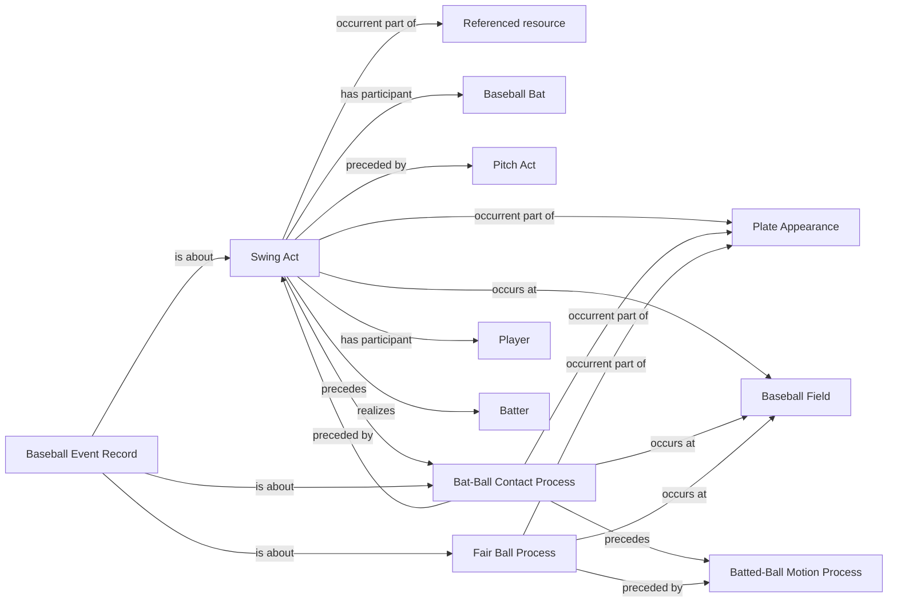

<!-- Generated by scripts/generate_rml_mermaid.py; do not edit. -->
<!-- Mapping SHA-256: bed3f052e82a896b8529c67b8e2a5c9746b06eef0788276d70bec48335fb63a4 -->

# In-play out contact

A swing and contact precede a fair-ball process for an in-play event whose feed call is out.

This view shows the ontology pattern without MLB JSON paths or RML machinery.

## RML evidence boundary

Generated from: `InPlayOutSwingActMap`, `InPlayOutSwingActMapRecordAboutMap`, `InPlayOutContactMap`, `InPlayOutContactMapRecordAboutMap`, `InPlayOutFairBallMap`, `InPlayOutFairBallMapRecordAboutMap`.
