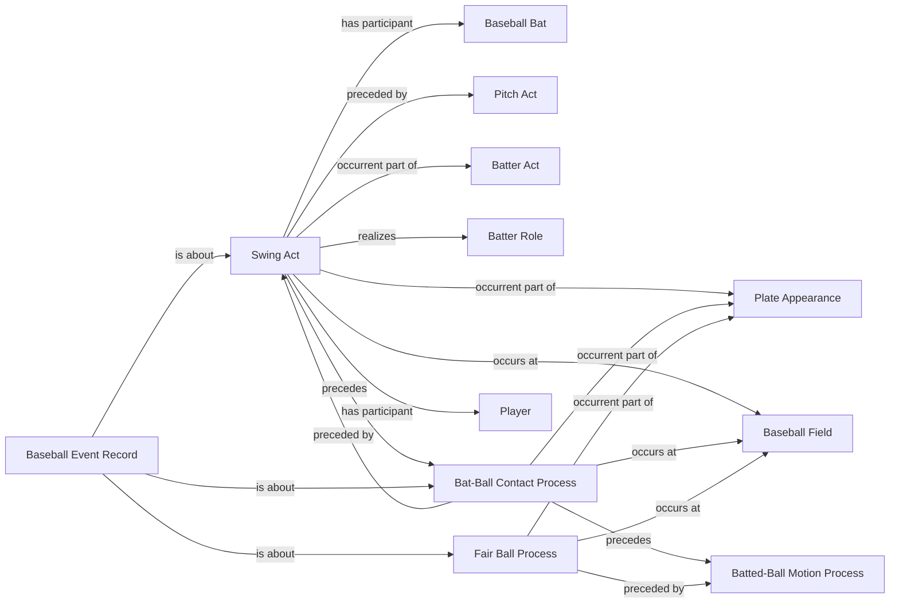

<!-- Generated by scripts/generate_rml_mermaid.py; do not edit. -->
<!-- Mapping SHA-256: a288d8d9e8e638468897751f8eda557afe2f40c2d055fa2acb378682b778531d -->

# In-play runs contact

A swing and contact precede a fair-ball process for an in-play event whose feed call records runs.

This view shows the ontology pattern without MLB JSON paths or RML machinery.

## RML evidence boundary

Generated from: `InPlayRunsSwingActMap`, `InPlayRunsSwingActMapRecordAboutMap`, `InPlayRunsContactMap`, `InPlayRunsContactMapRecordAboutMap`, `InPlayRunsFairBallMap`, `InPlayRunsFairBallMapRecordAboutMap`.
