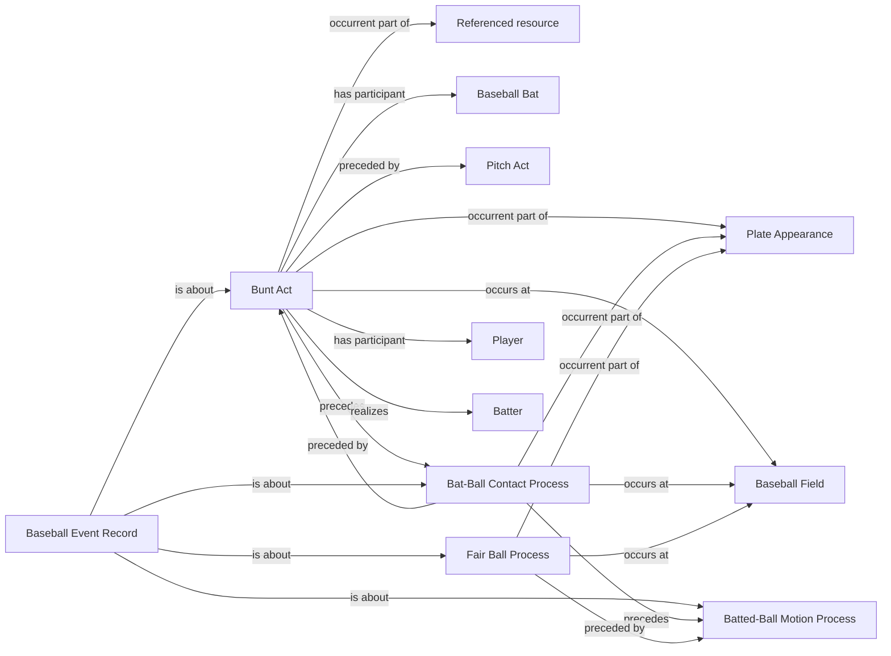

<!-- Generated by scripts/generate_rml_mermaid.py; do not edit. -->
<!-- Mapping SHA-256: f1f0054989fa91a76b8aa21a857f8b08cdeea24a88177e68a5ec0bb7ad0c493e -->

# Bunt contact

Every supported bunt attempt creates a Bunt Act; only contact-supported attempts precede contact, and only in-play bunt evidence creates a fair-ball process.

This view shows the ontology pattern without MLB JSON paths or RML machinery.

## RML evidence boundary

Generated from: `BuntActMap`, `BuntActContactSequenceMap`, `BuntContactMap`, `BuntFairBallMap`, `BuntRecordAboutMap`, `BuntContactRecordAboutMap`, `BuntFairBallRecordAboutMap`.
